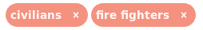
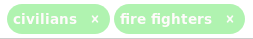
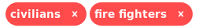
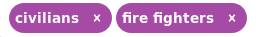

<h1 align="center">Atlas Project</h1>
<p align="center">
</img>
</p>

___
Web Application built with MongoDB, Django, Redux, ReactJS, and D3 that allows public 
safety proefssionals to enter information related to scenarios that they encounter 
on the job to help organize and link related incidents and organizations based on common
information.

The application includes a number of components to help with storing and searching
for information including: 

* **Database:**  MongoDB database stores information about scenarios as "Use Cases" which are comprised of a number of subcomponents. Each subcomponent has its own collection and the entries in each "Use Case" are lists of ids of the entries in the subcomponent's collection. 
* **REST API:** The REST API enables searching for database entries using keywords organized through HTTP queries. Written using a combination of Django boilerplate code and custom Views for translating REST queries to MongoDB database queries. 
* **Frontend Application** The frontend application consists of three pages that help to visualize the information contained in the database and allow the user to insert, update, and remove any component. The pages included in the application are: 
  * **Use Case Catalog** Lists all the use cases along with tables containing their subcomponent entries. When you click on a Use Case a more detailed page is rendered that allows you to update or delete information for that Use Case. There is also a separate tab that when clicked will create a D3 force directed graph of the subcomponents of that Use Case, which automatically updates as information is added or removed from that Use Case. 
  * **Information Type Catalog** Use Cases contain subcategories of information labeled 'Information Types', which are higher level descirptions of types of information that pertain to a particular Use Case that can be common among different Use Cases. These Information Types include: 
    * Title
    * Description of what the Information Type Represents, 
    * Rating for its overall Confidentiality/Integrity/Availability as it applies to information security
    * Information Categories (subcomponent which represents more specific items than information types)
    * Security Reasoning for Information Type
  * **Glossary** Collection of Subcomponents that make up Use Cases and Information Types. The Glossary holds the name and description of each subcomponent, as well as potentially links to more detailed descriptions of what the entry in the Glossary represents.  
___

### Search Options

The Use Case Catalog and Information Type Catalog pages both contain a search bar that allows you to use keywords to filter entries in the database. Using the REST API, the search options entered by the user will be translated into a REST query that will help users to filter Use Cases and Information Types by their subcomponents. 

The keyword(s) selected in the search bar will automatically filter entries for those keyword(s) and will default to being orange. The color of the keywords in teh search bar indicates what kind of search it is attempting to do:

  </img> Entries including both keywords together are returned. 
  </img>  Entries including either keyword in them are returned.
  </img> Entries without both of the keywords together in them are returned.
  </img> Entries with neither of the keywords in them are returned.
  
To switch between the search option for keywords, just click on the keyword in the search bar. All keywords pertaining to one subcomponent will change color when on eof the keywords is clicked, but all others will remain the same. 

___

### Running the Application

#### Setting Up the Environment

To run the application first make sure that MongoDB, Python3, and Yarn or NPM is isntalled on your system. After these dependencies are installed run the following to install the necessary packages to run the REST API:

```
pip(3) install -r requirements.txt
```

This should install Django an dthe necessary Python packages to set up the REST API. From here you need to install the necessary javascript packages using the package.json file in the repository. We recommend using Yarn as your installation tool but it could also be done using NPM. 

```
yarn
```

This should install the necessary packages to get the application ready to run. 

#### Creating the Database

The master version of the database is kept in the atlas_database_backup directory, and a tool is provided to export or import the database whenever needed. To import the database run: 

```
python(3) AtlasDatabaseUpdater.py --host [host address (default is localhost] --action [export or import] --output_file [filename if exporting] --input_file [input filename if importing] --reset [if you want to delete database conetnts before importing (y or yes)]
```

#### Run Application

Now that the database is imported all that is left is to run the application. To run the application you must first start the Web Server with the REST API using:

```
python(3) manage.py runserver [optionally provide host address and port number if not running on localhost]
```

Now that the REST API is running you can run the web application using: 

```
yarn start-dev
```

or

```
yarn start-opt
```

to run the optimized version , which takes longer to build. 

After the application is running you can visit the address in your web browser to start using Atlas. The default address is http://localhost:8000


